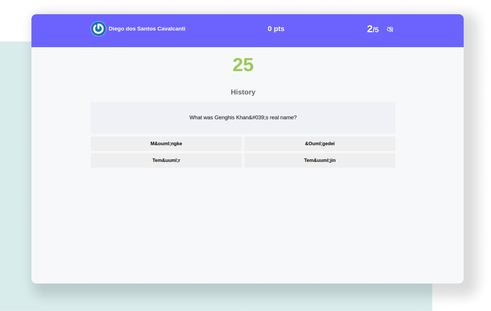

# Jogo de Trivia

jogo de perguntas e respostas baseado no jogo Trivia (tipo um show do milhão americano rs) utilizando React e Redux, desenvolvendo em grupo suas funcionalidades de acordo com as demandas definidas em um quadro Kanban. Sua pontuação é calculada em tempo real bem como o ranking. É possivel fazer configurações de tipos de pergunta e seus níveis de difuculdade, aumentar e abaixar volume do som.

> **Preview:**
> 👉 [Jogar Trivia](https://jogo-trivia-sandy.vercel.app/)

## Habilidades: 

Neste projeto pude práticar e aprimorar meus conhecimentos em:

- **Autenticação Api** via token
- **Javascript** 
- **Redux** para gerenciamento global da aplicação.
- **React Hook** (useState, useEffect).
- **React Hooks Customizados**.
- **React testing library** para garantir a qualidade do código e testar possíveis interações do usuário.
- **Trabalho em equipe**.
- **Scrum Master** para gerenciamento de projetos.
- **Trello** para divisão de tarefas e atualizações do desenvolvimento.

## Apis:

#### TheMealDB API

A [Trivia API](https://opentdb.com/api_config.php) Database fornece uma API JSON totalmente gratuita para uso em projetos de programação. É preciso gerar um token de autenticação para ter acesso a perguntas triviais.

## Bibliotecas que contém neste projeto:
* **[ReactJS](https://pt-br.reactjs.org/)**
* **[Redux](https://redux.js.org/)**
* **[React Testing Library](https://testing-library.com/docs/react-testing-library/intro/)**

## Layout:

